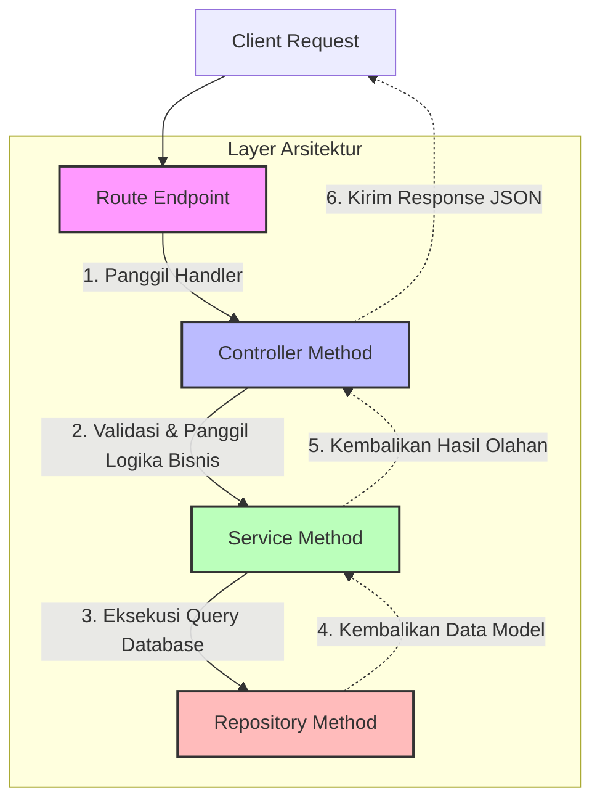

# Dokumentasi Alur Endpoints dan Arsitektur (Sitako Backend)

Dokumen ini dibuat untuk membantu programmer baru atau anggota tim lain memahami alur arsitektur proyek ini. Proyek ini menggunakan arsitektur berlapis (layered architecture) yang memisahkan tanggung jawab antara *Routing*, *Controller*, *Service*, dan *Repository*.

## Visualisasi Arsitektur (Request Lifecycle)

Setiap request masuk akan melewati alur berikut:

1. **Router (`src/routes/*`)**: Bertugas mendefinisikan URL/Endpoint HTTP (GET, POST, PUT, DELETE) dan Middleware (contoh: autentikasi, upload file).
2. **Controller (`src/controllers/*`)**: Menangkap request (`req`, `res`), memvalidasi input, memanggil service yang sesuai, dan mengirimkan response balikan ke user.
3. **Service (`src/services/*`)**: Tempat di mana inti business logic (logika bisnis) berjalan, seperti upload file, kalkulasi, dll., sebelum memanggil fungsi repository.
4. **Repository (`src/repositories/*`)**: Bertanggung jawab khusus untuk interaksi langsung dengan database (Querying, Insert, Update, Delete).

---

## Pemetaan Lengkap (Endpoint Mapping)

Berikut adalah mapping alur fungsi dari masing-masing fitur utama beserta deskripsi fungsinya berdasarkan pola codebase yang ada.

### 1. Fitur Autentikasi (`/auth`)

| Endpoint | HTTP Method | Fungsi / Deskripsi | Method Controller | Method Service | Method Repository |
| :--- | :--- | :--- | :--- | :--- | :--- |
| `/auth/captcha` | GET | Mendapatkan gambar CAPTCHA untuk verifikasi keamanan saat login | `getCaptcha` | *(Generate via library)* | *(Tidak ada)* |
| `/auth/login` | POST | Melakukan login untuk Pustakawan dan Anggota menggunakan identifier | `login` | `authenticateUser` | `findLibrarianByNip` / `findMemberByNis` |
| `/auth/logout` | POST | Mengakhiri sesi pengguna dengan menghapus cookie token | `logout` | *(Clear Cookie)* | *(Tidak ada)* |

### 2. Fitur Buku (`/books` & `/book`)

| Endpoint | HTTP Method | Fungsi / Deskripsi | Method Controller | Method Service | Method Repository |
| :--- | :--- | :--- | :--- | :--- | :--- |
| `/books/` | GET | Mengambil daftar seluruh buku dengan fitur pagination dan pencarian | `getBookHandler` | `getBooksWithPagination` | `findBooksWithPagination` |
| `/books/detail/:id` | GET | Menampilkan rincian informasi dan data dari suatu buku secara spesifik | `showBook` | `getBookById` | `findBook` |
| `/books/` | POST | Menambahkan data buku baru beserta file PDF / Cover-nya ke sistem | `createBook` | `createNewBook` | `insertBook` |
| `/books/:id` | PUT | Mengubah / memperbarui data buku yang sudah ada di sistem | `updateBook` | `updateExistingBook` | `updateBookById` |
| `/books/:id` | DELETE | Menghapus data sebuah buku dari sistem beserta file terkaitnya | `deleteBook` | `deleteExistingBook` | `removeBookById` |
| `/book/` | GET | Mengambil daftar katalog seluruh buku yang dapat dipinjam oleh member dengan pagination | `getAvailableBooks` | `getAvailableBooksWithPagination` | `findAvailableBooksWithPagination` |
| `/book/digital/read/:id` | GET | Memberikan akses untuk melihat/membaca file buku digital (PDF) | `readDigitalBook` | - | - |
| `/book/bookmark` | GET | Mengambil daftar seluruh buku yang disimpan (bookmark) oleh member dengan pagination | `getMyBookmarks` | `getBookmarksWithPagination` | `findBookmarksWithPagination` |
| `/book/bookmark/:id` | POST | Menambahkan buku ke daftar simpanan (bookmark) milik member/anggota | `createBookmark` | `createNewBookmark` | `insertBookmark` |
| `/book/bookmark/delete/:bookmarkId` | DELETE | Menghapus buku dari daftar simpanan (bookmark) member/anggota | `deleteBookmark` | `deleteExistingBookmark` | `removeBookmarkById` |

### 3. Fitur Rak & Tumpukan Buku (`/shelves`)

| Endpoint | HTTP Method | Fungsi / Deskripsi | Method Controller | Method Service | Method Repository |
| :--- | :--- | :--- | :--- | :--- | :--- |
| `/shelves/` | GET | Mengambil daftar lokasi rak penyimpanan buku di perpustakaan | `getShelvesHandler` | `getShelvesWithPagination` | `findShelvesWithPagination` |
| `/shelves/detail/:id` | GET | Menampilkan detail informasi dari satu rak secara spesifik | `showShelf` | `getShelfById` | `findShelf` |
| `/shelves/` | POST | Membuat dan mendaftarkan data lokasi rak baru | `createShelf` | `createNewShelf` | `insertShelf` |
| `/shelves/:id` | PUT | Memperbarui nama atau detail mengenai sebuah rak | `updateShelf` | `updateExistingShelf` | `updateShelfById` |
| `/shelves/:id` | DELETE | Menghapus data rak dari sistem | `deleteShelf` | `deleteExistingShelf` | `removeShelfById` |

> _Catatan: Pola sub-endpoint `/stacks` juga diterapkan pada fitur rak ini._

### 4. Fitur Transaksi (`/transactions`)

| Endpoint | HTTP Method | Fungsi / Deskripsi | Method Controller | Method Service | Method Repository |
| :--- | :--- | :--- | :--- | :--- | :--- |
| `/transactions/` | GET | Mengambil riwayat daftar transaksi (peminjaman/pengembalian) buku | `getTransactionsHandler` | `getTransactionsWithPagination` | `findTransactionsWithPagination` |
| `/transactions/detail/:id`| GET | Menampilkan detail dari transaksi peminjaman secara spesifik | `showTransaction` | `getTransactionById` | `findTransaction` |
| `/transactions/` | POST | Membuat rekam transaksi peminjaman buku yang baru (Check Out) | `createTransaction` | `createNewTransaction` | `insertTransaction` |
| `/transactions/:id` | PUT | Memperbarui status transaksi (seperti penyetujuan, pengembalian) | `updateTransaction` | `updateExistingTransaction` | `updateTransactionById` |
| `/transactions/:id` | DELETE | Menghapus riwayat atau log log transaksi tertentu (opsional) | `deleteTransaction` | `deleteExistingTransaction` | `removeTransactionById` |

### 5. Fitur Denda (`/fine-payments` & `/fines`)

| Endpoint | HTTP Method | Fungsi / Deskripsi | Method Controller | Method Service | Method Repository |
| :--- | :--- | :--- | :--- | :--- | :--- |
| `/fine-payments/` | GET | Mendapatkan daftar seluruh bukti pembayaran denda keterlambatan | `getFinePaymentsHandler` | `getFinePaymentsWithPagination` | `findFinePaymentsWithPagination` |
| `/fine-payments/:id` | GET | Melihat detail dari proses pembayaran suatu denda | `showFinePayment` | `getFinePaymentById` | `findFinePayment` |
| `/member/fine-payments/pay` | POST | Menginisiasi pembayaran denda secara online via Tripay | `initiatePayment` | `initiateOnlinePayment` | `insertFinePayment` |
| `/webhooks/tripay` | POST | Menerima notifikasi otomatis (Callback) dari Tripay saat pembayaran lunas | `tripayWebhook` | *(Direct)* | `updateFinePaymentById` |
| `/fines/` | GET | Mengambil semua catatan tanggungan denda yang sedang atau belum dibayar | `getFinesHandler` | `getFinesWithPagination` | `findFinesWithPagination` |
| `/fines/detail/:id` | GET | Menampilkan rincian jumlah denda spesifik pada suatu transaksi | `showFine` | `getFineById` | `findFine` |

### 6. Fitur Pengguna (`/user/librarians` & `/user/members`)

| Endpoint | HTTP Method | Fungsi / Deskripsi | Method Controller | Method Service | Method Repository |
| :--- | :--- | :--- | :--- | :--- | :--- |
| `/user/librarians/:id` | GET | Menampilkan rincian data profil milik seorang Pustakawan | `showLibrarian` | `getLibrarianById` | `findLibrarian` |
| `/user/members/:id` | GET | Menampilkan rincian data profil milik seorang Anggota (Member) | `showMember` | `getMemberById` | `findMember` |

### 7. Fitur Dashboard Pustakawan (`/dashboard`)

| Endpoint | HTTP Method | Fungsi / Deskripsi | Method Controller | Method Service | Method Repository |
| :--- | :--- | :--- | :--- | :--- | :--- |
| `/dashboard/summary` | GET | Mengambil ringkasan data total buku, anggota, peminjaman, dan denda | `getSummary` | `getDashboardSummaryService` | `getDashboardSummaryRepo` |
| `/dashboard/transaction/today` | GET | Mengambil daftar transaksi peminjaman/pengembalian khusus hari ini | `getTodayTransactions` | `getTodayTransactionsService` | `getTodayTransactionsRepo`, `getTodaySummaryRepo` |
| `/dashboard/statistics` | GET | Mengambil statistik tren transaksi 7 hari terakhir (dengan Redis cache) | `getWeeklyStatistics` | `getWeeklyStatisticsService` | `getWeeklyStatisticsRepo` |

### 8. Fitur Profil Mandiri (`/profile`)

| Endpoint | HTTP Method | Fungsi / Deskripsi | Method Controller | Method Service | Method Repository |
| :--- | :--- | :--- | :--- | :--- | :--- |
| `/profile/me` | GET | Menampilkan profil pengguna yang sedang login (Pustakawan / Anggota) | `getMyProfile` | `getProfileService` | `findLibrarianById` / `findMemberById` |
| `/profile/me` | PUT | Memperbarui data profil mandiri pengguna yang sedang login | `updateMyProfile` | `updateProfileService` | `updateLibrarianById` / `updateMemberById` |

### 9. Fitur Dashboard Member (`/member/dashboard`)

| Endpoint | HTTP Method | Fungsi / Deskripsi | Method Controller | Method Service | Method Repository |
| :--- | :--- | :--- | :--- | :--- | :--- |
| `/member/dashboard` | GET | Mengambil statistik buku dipinjam, total denda, bookmark, transaksi aktif, tagihan denda, dan bookmark terbaru member | `getMemberDashboard` | `getMemberDashboardService` | `getMemberDashboardRepo` |

### 10. Fitur Laporan Sirkulasi & Denda (`/reports`)

| Endpoint | HTTP Method | Fungsi / Deskripsi | Method Controller | Method Service | Method Repository |
| :--- | :--- | :--- | :--- | :--- | :--- |
| `/reports/circulation` | GET | Mengambil laporan sirkulasi peminjaman buku (preview JSON, ekspor Excel, CSV, PDF) | `getCirculationReportHandler` | `getCirculationReport`, `exportCirculationExcel`, `exportCirculationCsv`, `exportReportPdf` | `getCirculationReport` |
| `/reports/fines` | GET | Mengambil laporan pembayaran denda (preview JSON, ekspor Excel, CSV, PDF) | `getFineReportHandler` | `getFineReport`, `exportFineExcel`, `exportFineCsv`, `exportReportPdf` | `getFineReport` |